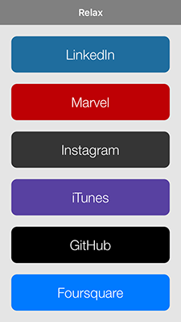
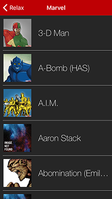
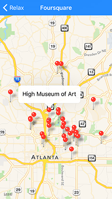
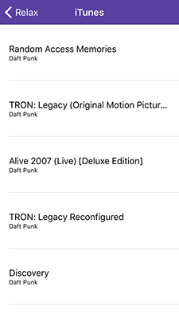

# Relax
RESTful API endpoint manager

## Needs

> This library will need a lot of management to keep APIs updated. My plan is to start laying them out and try to find others who use specific APIs and have them keep those up to date.

## Roadmap


#### APIs

- [x] ~~Done~~ : [Docs]() *documentation link* : [File]() *source file*
- [ ] ***Started*** : [Docs]() *documentation link* : [File]() *source file*
- [ ] Future : [Docs]() *documentation link*

**Please submit an issue if you would like a lead position for any (listed/unlisted) API**

--

- [x] ~~Foursquare~~ : [Docs](https://developer.foursquare.com) : [File](APIs/FoursquareAPI.swift)
- [x] ~~Instagram~~ : [Docs](https://www.instagram.com/developer/) : [File](APIs/InstagramAPI.swift)
- [x] ~~iTunes~~ : [Docs](https://www.apple.com/itunes/affiliates/resources/documentation/itunes-store-web-service-search-api.html) : [File](APIs/ItunesAPI.swift)
- [x] ~~Marvel~~ : [Docs](http://developer.marvel.com) : [File](APIs/MarvelAPI.swift)
- [x] ~~Uber~~ : [Docs](https://developer.uber.com) : [File](APIs/UberAPI.swift)
- [ ] ***Github*** : [Docs](https://developer.github.com/v3/) : [File](APIs/GitHubAPI.swift)
- [ ] ***Marta*** : [Docs](http://www.itsmarta.com/app-developer-resources.aspx) : [File](APIs/MartaAPI.swift)


--

- [ ] Flickr : [Docs](https://www.flickr.com/services/api/)
- [ ] LinkedIn : [Docs](https://developer.linkedin.com/docs)
- [ ] Meetup : [Docs](http://www.meetup.com/meetup_api/)
- [ ] Pinterest : [Docs](https://developers.pinterest.com)
- [ ] Slack : [Docs](https://api.slack.com)
- [ ] Twitter : [Docs](https://dev.twitter.com/overview/documentation)
- [ ] Youtube : [Docs](https://developers.google.com/youtube/)
- [ ] Netflix : [Docs](http://developer.netflix.com)
- [ ] GuideBox : [Docs](https://api.guidebox.com/docs)
	- [ ] Hulu
	- [ ] Amazon

--

**API Groups**

- [Google Products](https://developers.google.com/products/)
	- [ ] Analytics : [Docs](https://developers.google.com/analytics/)
	- [ ] Maps : [Docs](https://developers.google.com/maps/)
- [Facebook Products](https://developers.facebook.com/docs/)
	- [ ] Graph API : [Docs](https://developers.facebook.com/docs/graph-api)

**Please submit an issue for any APIs you would like to see added.**

---

#### Features

- [ ] Response Object Structure (still dreaming this up)
- [x] ~~Authentication Structure~~ *docs coming soon*

## Usage

To run the example project, clone the repo, and run `pod install` from the Example directory first.

Example project screens.






### Choose or Create API

Go [here](APIs) to choose a prebuilt API or create your own. The example below uses the prebuilt [GitHubAPI](APIs/GitHubAPI.swift).

### Use API

> You will need to [register an application](https://github.com/settings/applications/new). Then create a Keys.swift file (make sure to ignore the file if your repo is public).

**run a request**

```swift
let githubAPI = GithubAPI.session
        
// setup endpoint
    
var profile = GithubAPI.Endpoints.UsersNamed.endpoint
    
profile.pathpieces = ["username" : "joalbright"]
    
// run request
    
githubAPI.request(profile) {
   
   // object returned = $0.info 
   // error returned = $0.error 
	    
}

```

## Requirements

This uses [Parsable](https://github.com/joalbright/Parsable).


## Author

[Jo Albright](https://github.com/joalbright)

## License

Relax is available under the MIT license. See the LICENSE file for more info.
